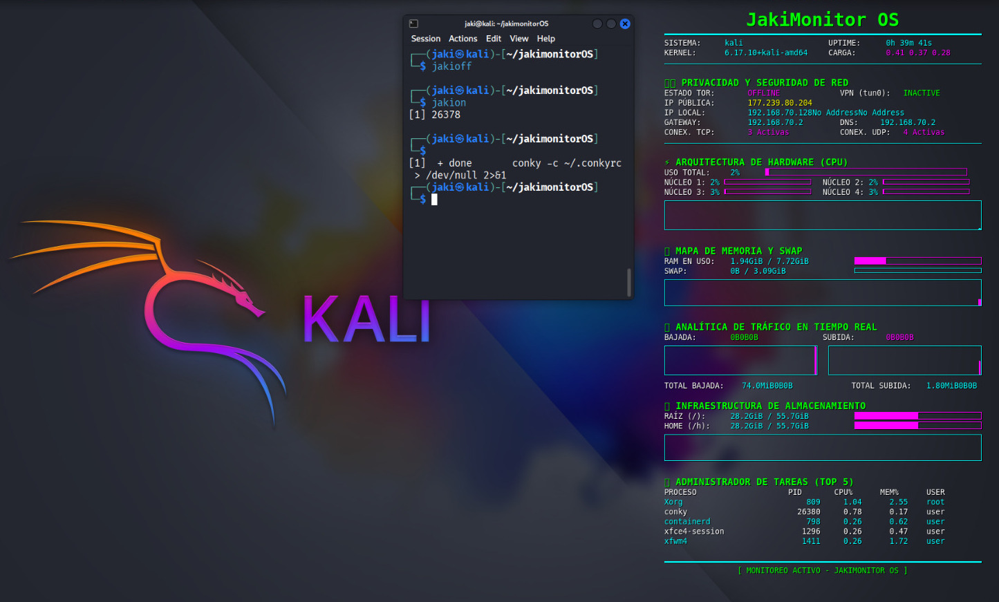

# 🚀 JakiMonitor OS  - Edition

**JakiMonitor OS** es un monitor de sistema avanzado diseñado específicamente para **Kali Linux**. Inspirado en la estética de Kodachi, ofrece una visión completa de la seguridad, red y hardware de tu máquina en tiempo real.



## 🕵️ Características Principales
- **Seguridad de Red:** Estado de TOR, VPN (tun0), IP Pública y conteo de conexiones TCP/UDP.
- **Hardware Pro:** Monitoreo de 4 núcleos de CPU, carga de RAM y Swap con gráficas en tiempo real.
- **Analítica de Tráfico:** Velocidades de subida/bajada y total de datos transferidos.
- **Gestión de Almacenamiento:** Estado de las particiones Raíz y Home.
- **Top Procesos:** Visualización de los 5 procesos que más recursos consumen.

## 📥 Instalación Rápida
Abre tu terminal de Kali y ejecuta los siguientes comandos:

```bash
git clone https://github.com/JakiNet/jakimonitor-os.git
cd jakimonitor-os
chmod +x install.sh
./install.sh
```
## 🕹️ Comandos de Uso

Después de la instalación, puedes usar estos comandos desde cualquier terminal:

    jakion: Enciende el monitor.

    jakioff: Apaga el monitor.

🛠️ Requisitos

    Kali Linux (Compatible con Bash y Zsh)

    Conky-all (Instalado automáticamente por el script)

Desarrollado con ❤️ por Jaki.
